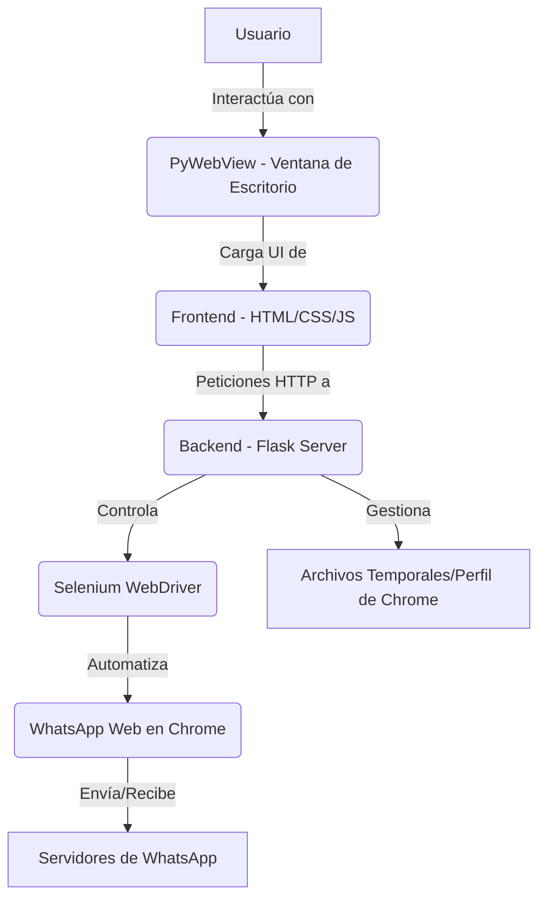

# Asistente Tanya: Automatización Inteligente de WhatsApp

Este proyecto es una aplicación de escritorio que facilita el envío automatizado y personalizado de mensajes de WhatsApp, incluyendo la capacidad de adjuntar imágenes. Su diseño se centra en simular el comportamiento humano para minimizar el riesgo de detección y bloqueo por parte de WhatsApp.

## Características Principales

-   **Envío de Mensajes Personalizados**: Permite enviar mensajes de texto con personalización dinámica (ej. `{nombre}`).
-   **Soporte para Imágenes**: Capacidad de adjuntar imágenes a los mensajes, copiándolas al portapapeles y pegándolas en la interfaz de WhatsApp Web.
-   **Interfaz de Usuario Intuitiva**: Una interfaz web local (servida por Flask) encapsulada en una ventana de escritorio (PyWebView) para una experiencia de usuario amigable.
-   **Automatización Robusta**: Utiliza Selenium para interactuar con WhatsApp Web de manera controlada y eficiente.
-   **Persistencia de Sesión**: Mantiene la sesión de WhatsApp Web iniciada a través de un perfil de usuario de Chrome dedicado, evitando la necesidad de escanear el código QR repetidamente.
-   **Manejo de Procesos**: Incluye lógica para asegurar el cierre limpio de los procesos de Chrome y Chromedriver al finalizar la aplicación.

## Arquitectura del Proyecto

El Asistente Tanya se construye sobre una arquitectura cliente-servidor ligera, donde:

-   **Backend (Python/Flask)**: Un servidor Flask maneja la lógica de negocio, la comunicación con Selenium y la gestión de archivos.
-   **Frontend (HTML/CSS/JavaScript)**: Una interfaz de usuario basada en tecnologías web que se comunica con el backend a través de peticiones HTTP.
-   **Automatización (Selenium)**: Controla una instancia de Chrome para interactuar con WhatsApp Web.
-   **Empaquetado (PyInstaller)**: Permite compilar la aplicación Python en un ejecutable (`.exe`) para Windows, facilitando su distribución.
-   **Contenedor de UI (PyWebView)**: Incrusta la interfaz web del frontend en una ventana de escritorio nativa, proporcionando una experiencia de aplicación de escritorio.



## Simulación de Comportamiento Humano y Anti-Detección

Uno de los pilares de este asistente es su enfoque en la simulación de interacciones humanas para reducir el riesgo de que la cuenta de WhatsApp sea marcada o baneada. Esto se logra mediante varias técnicas implementadas en el script de Python:

1.  **Pausas Estratégicas (`time.sleep`)**:
    Se insertan pausas deliberadas en puntos críticos del flujo de automatización. Esto imita los tiempos de reacción naturales de un usuario y evita que las acciones se ejecuten a una velocidad "robótica".

    ```python
    import time
    # ...
    message_box.click() # Asegurarse de que el cuadro de texto tiene el foco
    time.sleep(0.5) # Pequeña pausa después del clic
    # ...
    time.sleep(0.1) # Pausa entre el envío de cada línea del mensaje
    # ...
    time.sleep(2) # Pausa después de copiar la imagen al portapapeles
    ```

2.  **Escritura Gradual del Mensaje (Line-by-Line Typing)**:
    En lugar de pegar el mensaje completo de una sola vez, el script simula la escritura línea por línea. Esto es crucial, ya que pegar grandes bloques de texto es un comportamiento atípico para un usuario y puede ser detectado.

    ```python
    from selenium.webdriver.common.keys import Keys
    # ...
    for line in mensaje_personalizado.split('\n'):
        message_box.send_keys(line)
        message_box.send_keys(Keys.SHIFT, Keys.ENTER) # Simula Shift+Enter para nueva línea
        time.sleep(0.1) # Pequeña pausa entre líneas
    message_box.send_keys(Keys.ENTER) # Envía el mensaje al final
    ```

3.  **Manejo Robusto de Elementos (`WebDriverWait` y `expected_conditions`)**:
    El script espera explícitamente a que los elementos de la interfaz de WhatsApp Web estén visibles y sean interactuables antes de intentar realizar una acción. Esto no solo mejora la fiabilidad de la automatización (evitando errores por elementos no cargados), sino que también simula la paciencia de un usuario esperando que la página responda.

    ```python
    from selenium.webdriver.support.ui import WebDriverWait
    from selenium.webdriver.support import expected_conditions as EC
    from selenium.webdriver.common.by import By
    # ...
    wait = WebDriverWait(driver, 60) # Espera máxima de 60 segundos
    # Espera a que la barra de búsqueda de chats esté presente
    search_chat_xpath = '//div[@contenteditable="true"][@data-tab="3"] | //div[@role="textbox"][@title="Buscar o iniciar un chat"]';
    wait.until(EC.presence_of_element_located((By.XPATH, search_chat_xpath)))
    # ...
    # Espera a que el cuadro de mensaje sea visible y clickeable
    message_box_xpath = '//div[@aria-label="Escribe un mensaje"] | //div[@contenteditable="true"][@data-tab="10"]';
    message_box = wait.until(EC.visibility_of_element_located((By.XPATH, message_box_xpath)))
    message_box = wait.until(EC.element_to_be_clickable((By.XPATH, message_box_xpath)))
    ```

4.  **Perfil de Navegador Persistente (`user-data-dir`)**:
    La aplicación utiliza un directorio de datos de usuario de Chrome específico. Esto permite que la sesión de WhatsApp Web (incluyendo el inicio de sesión y las cookies) se mantenga entre diferentes ejecuciones de la aplicación, lo cual es un comportamiento normal para un usuario que no cierra sesión constantemente.

    ```python
    from selenium import webdriver
    import os
    # ...
    CHROME_PROFILE_PATH = os.path.join(USER_DATA_PATH, "ChromeProfile")
    # ...
    options = webdriver.ChromeOptions()
    options.add_argument(f"user-data-dir={CHROME_PROFILE_PATH}")
    driver = webdriver.Chrome(service=s_driver_service, options=options)
    ```

5.  **Manejo de Imágenes vía Portapapeles**:
    Para adjuntar imágenes, el script las copia al portapapeles del sistema operativo y luego simula la acción de pegar (`Ctrl+V`) en el cuadro de texto de WhatsApp Web. Este método es más natural que la interacción directa con el diálogo de carga de archivos, que puede ser más propenso a la detección.

    ```python
    import win32clipboard
    import win32con
    import io
    from PIL import Image
    # ...
    def send_to_clipboard(filepath):
        try:
            image = Image.open(filepath)
            output = io.BytesIO()
            image.convert("RGB").save(output, "BMP")
            data = output.getvalue()[14:]
            win32clipboard.OpenClipboard()
            win32clipboard.EmptyClipboard()
            win32clipboard.SetClipboardData(win32con.CF_DIB, data)
            win32clipboard.CloseClipboard()
        except Exception as e:
            print(f"Error al copiar imagen al portapapeles: {e}")
    # ...
    message_box.send_keys(Keys.CONTROL, 'v') # Simula Ctrl+V
    ```

Estas técnicas, combinadas, buscan crear un patrón de interacción que sea lo más indistinguible posible del comportamiento de un usuario humano, reduciendo así el riesgo de ser detectado por los sistemas de seguridad de WhatsApp.

## Instalación y Uso (para desarrolladores)

Para ejecutar el proyecto desde el código fuente:

1.  **Clona el Repositorio**:
    ```bash
    git clone https://github.com/sofos666/Asistente-.exe.git
    cd Asistente-.exe
    ```

2.  **Crea un Entorno Virtual** (recomendado):
    ```bash
    python -m venv venv
    # En Windows:
    venv\Scripts\activate
    # En macOS/Linux:
    source venv/bin/activate
    ```

3.  **Instala las Dependencias**:
    ```bash
    pip install -r requirements.txt
    ```
    (Nota: Necesitarás un `requirements.txt` que contenga `Flask`, `selenium`, `webdriver-manager`, `Pillow`, `pywin32`, `pywebview`, `psutil`).

4.  **Configura tu Perfil de Chrome**:
    Cierra todas las ventanas de Google Chrome. Abre una terminal y ejecuta el siguiente comando para crear un perfil de Chrome dedicado para el bot. Este perfil mantendrá tu sesión de WhatsApp Web iniciada.
    ```bash
    "C:\Program Files\Google\Chrome\Application\chrome.exe" --remote-debugging-port=9222 --user-data-dir="C:\Users\elloc\AsistenteTanyaData\ChromeProfile"
    ```
    En la nueva ventana de Chrome que se abre, navega a `web.whatsapp.com` y vincula tu teléfono escaneando el código QR. Una vez vinculado, puedes cerrar esta ventana de Chrome.

5.  **Inicia la Aplicación**:
    ```bash
    python servidor.py
    ```
    Esto iniciará el servidor Flask y abrirá la ventana de la aplicación de escritorio.

## Contribuciones

Las contribuciones son bienvenidas. Por favor, abre un *issue* para discutir cualquier mejora o corrección de errores.

## Licencia

Este proyecto está bajo la Licencia MIT.

